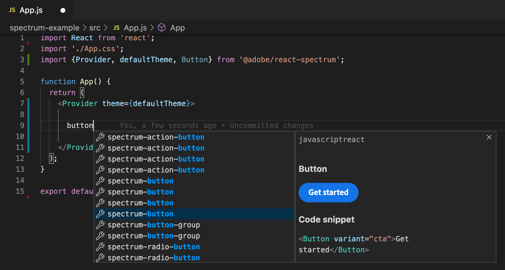
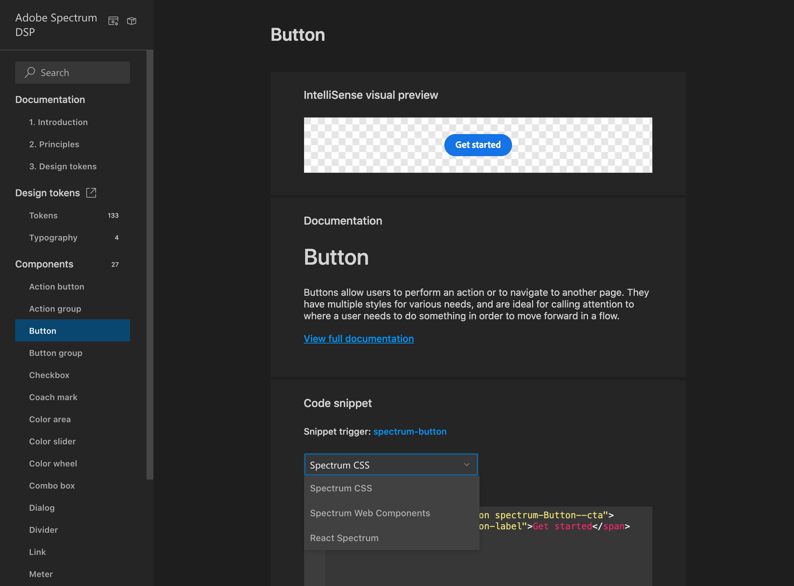

# adobe-spectrum-dsp beta

Adobe Spectrum Design System Package (DSP) beta, based on [spectrum.adobe.com](https://spectrum.adobe.com/), including design tokens, typography collections of tokens and components with [Spectrum React](https://react-spectrum.adobe.com/react-spectrum/index.html) code snippets.

> To install Adobe Spectrum DSP in your project, please run `npm install adobe-spectrum-dsp`

For questions, issues or feedback, please file an [issue here](https://github.com/demianborba/spectrum-dsp/issues).

Compiled design tokens available in `/dist` as Android, CSS, Flutter (Dart), iOS (Objective-C), iOS (Swift), JavaScript, and SCSS.

Code snippets available as Spectrum Android, Spectrum CSS and React Spectrum.

